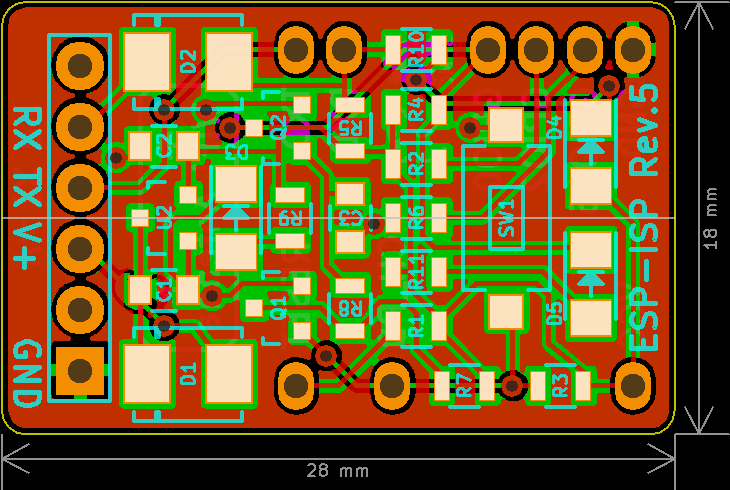

ESP-ISP
=======

This is just a simple programming jig for the ESP-12 module.

When putting this device together, use <=40-mil pogo pins for the ESP pins.
You can then place this device on top of a ESP-12 unit to access it's serial port.
(Be careful not to short any of the pogo pins on the metal can though. It can be tricky!)

* `P1` is normal FTDI header. 5V should work.
* `SW1` is a reset switch. Hold it down for >5s to bring `GPIO0` low and release to start flash mode.
* `D5` should light up when `GPIO0` is low.
* `D3` is a power indicator.
* `D2` should light up when the ESP is receiving serial data.

Check the schematic for the parts list.

